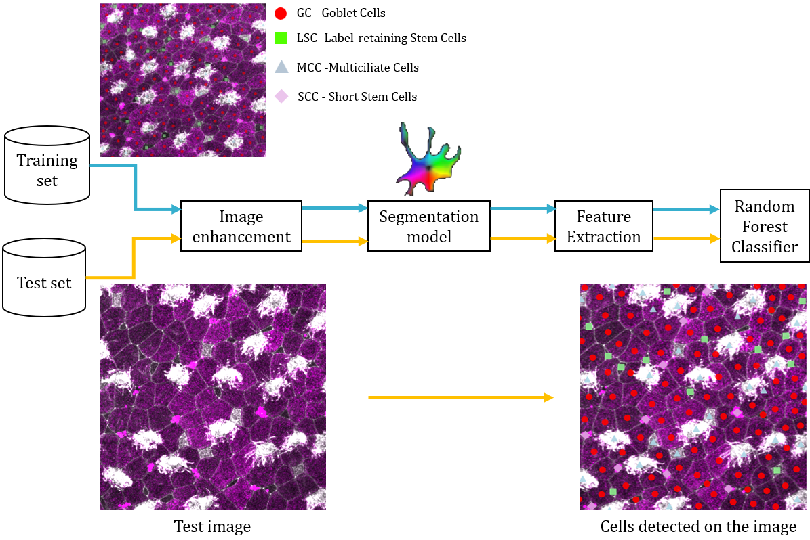

# Confocal image processing and analysis
Python scripts for detecting different cell types in the ciliated epithelium of Xenopus laevis tadpoles. The pipeline processes confocal microscopy images with multiple fluorescent channels (phalloidin/ZO-1 for cell boundaries, AcTub for MCCs, and PNA for goblet cells and SSCs) to classify cells into four distinct categories. Through sequential image processing steps, including imahe enhancement, cell segmentation, feature extraction, and machine learning classification, the workflow automatically identifies and quantifies the proportions of goblet cells, MCCs, ISCs, and SSCs. 

----------------------------------------

## Project Title
--- | --- | Automatic cell type classification for ciliated epithelium

## Installation

(Recommend) Create a conda environment:

    conda create -n multicelldetection_env python=3.11
    conda activate multicelldetection_env

Install PyTorch with GPU (for using cellpose)

    pip3 install torch torchvision torchaudio --index-url https://download.pytorch.org/whl/cu118

Install Cellpose

    python -m pip install cellpose[gui]
    
Install the codes

    pip install git+https://github.com/ledvic/multicelldetection.git

Updating

    conda activate multicelldetection_env
    pip install -U git+https://github.com/ledvic/multicelldetection.git
